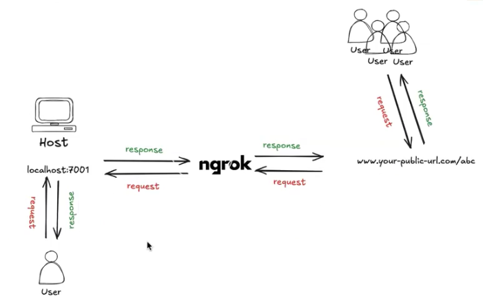
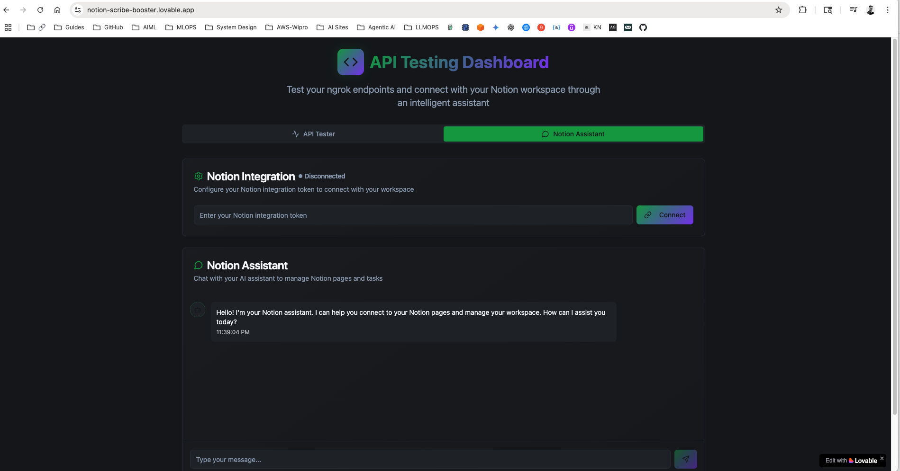

# Notion MCP Integration with Lovable Frontend

This project demonstrates how to integrate [Notion MCP (Machine Communication Protocol)](https://developers.notion.com/docs/get-started-with-mcp) with a frontend UI built using [Lovable](https://lovable.dev/). It allows sending tasks to a Notion-integrated backend server and visualizing the interactions through a simple web interface.

---

## 🔗 References

- **Notion MCP Docs:** [Get Started with MCP](https://developers.notion.com/docs/get-started-with-mcp)
- **MCP Server GitHub Repo:** [makenotion/notion-mcp-server](https://github.com/makenotion/notion-mcp-server?tab=readme-ov-file)

---

## 📡 Backend API (via curl)

Use the following `curl` command to test the server locally:

```bash
curl -X POST http://localhost:7001/run \
  -H "Content-Type: application/json" \
  -d '{"task": "create a page \'Arindam_Test\' "}'
```

# Create your frontend UI using Lovable.dev to interact with your backend endpoint.

### Prompt I have used:

```
https://2be26ac52145.ngrok-free.app/health

# curl -X POST http://localhost:7001/run \
#  -H "Content-Type: application/json" \
#  -d '{"task": "create a page 'Arindam_Test' "}'

can you create a quick front end in which we will have a chatbot to connect to my notion page, also fields and buttons to test my end points on above given url of ngrok. 
/health
/
/run (I have given the curl for this, which I could be able to edit)
```

### Dashboard created by loveable:


